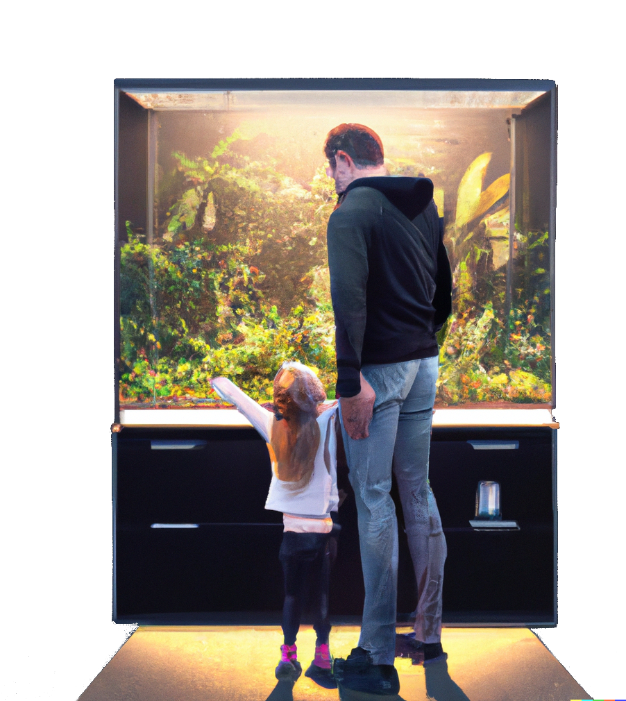

A vivarium brings the tranquility and rythms of the natural world into your living space. It fosters a deep human connection to nature by introducing an authentic living presence into our modern life.

The **Freya Vivarium Control System** helps manage and maintain the environment within your vivarium, using advanced climate control to support natural cycles. By processing data from sensors within the vivarium, such as temperature, humidity and light levels, Freya calculates the necessary actions for the actuators - such as heaters, humidifiers and lighting - to maintain the desired conditions.

#### Features
- **Climate control** for several environment variables, mimicing the natural environment.
- **Configurable cycles** for simulating day/night and seasonal changes.
- **Set it and forget it** by design. Operating quietly in the background, maintaining optimal conditions
<div clear="right"/>

### Alternate use cases
- **Greenhouse automation** and precision agriculture for optimized plant growth.
- **Distributed research** on the effects of climate(change) and the adaptability of living organisms.
- **Nature preservation** by providing controlled habitats for species from endagered environments.

## Getting started
To run the Freya Vivarium Control System software, a GNU/Linux system is required. For interactions with the physical world, sensors and actuators need to be interfaced with the software.

### Recommended hardware
TODO


### Software installation
On your device, install the Freya Vivarium Control System software by downloading and executing the installation script
```
wget -O install.sh https://github.com/Freya-Vivariums/Freya-core/releases/latest/download/install.sh;
chmod +x ./install.sh;
sudo ./install.sh;
```

## Support

<a href="https://www.patreon.com/bePatron?u=56439168" target="_blank">
    
</a>

The **Freya Vivarium Control System** is open source and free to use. If you'd like to support its development, consider contributing in code or throught patreon.

<div clear="right"/>