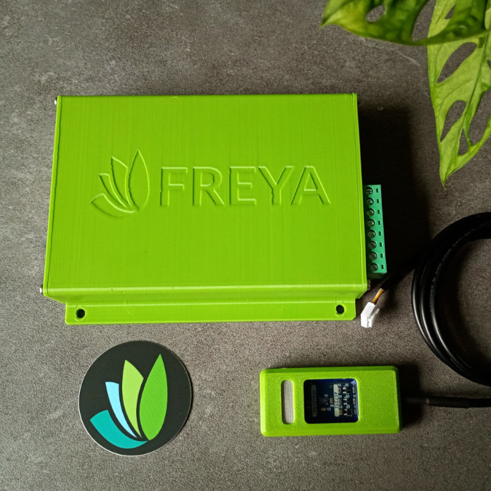
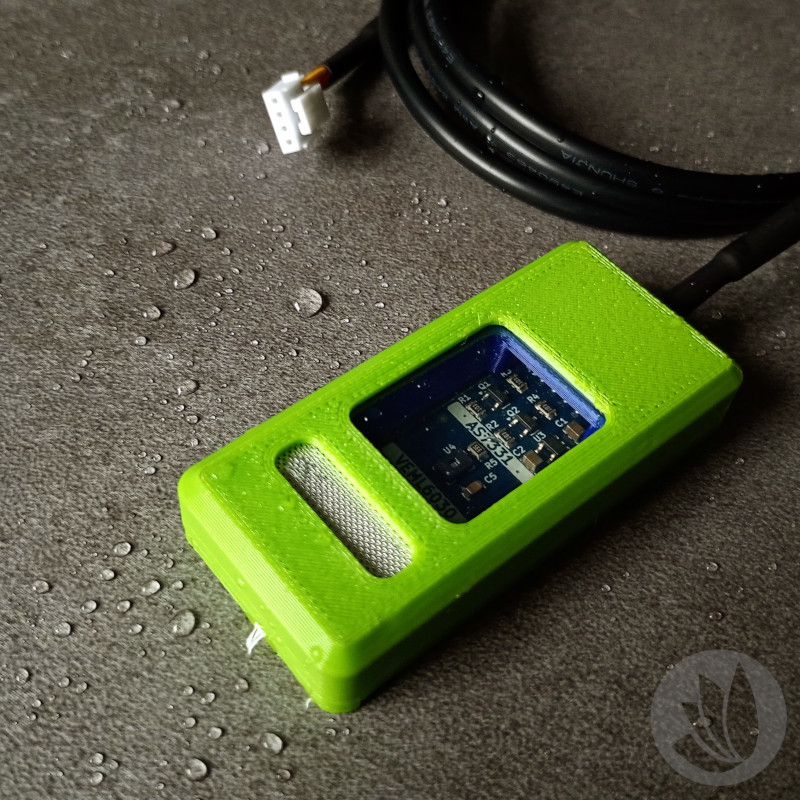
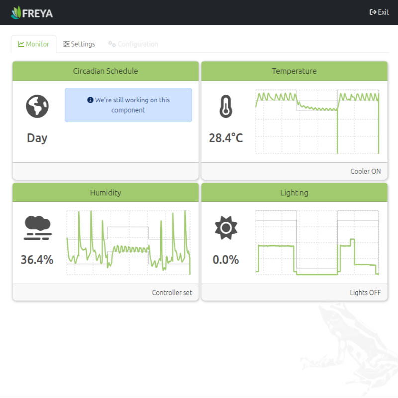

A vivarium brings the tranquility and rythms of the natural world into your living space. It fosters a deep human connection to nature by introducing an authentic living presence into our modern life.

The **Freya Vivarium Control System** helps manage and maintain the environment within your vivarium, using advanced climate control to support natural cycles. By processing data from sensors within the vivarium, such as temperature, humidity and light levels, Freya calculates the necessary actions for the actuators - such as heaters, humidifiers and lighting - to maintain the desired conditions.

#### Features
- **Climate control** for several environment variables, mimicing the natural environment.
- **Configurable cycles** for simulating day/night and seasonal changes.
- **Set it and forget it** by design. Operating quietly in the background, maintaining optimal conditions
 

### Alternate use cases
- **Greenhouse automation** and precision agriculture for optimized plant growth. (e.g. growing potatoes on Mars)
- **Distributed research** on the effects of climate(change) and the adaptability of living organisms.
- **Nature preservation** by providing controlled habitats for species from endangered environments.

## Freya Vivarium Control System

### The brain of your vivarium
The Freya Vivarium Control system is a computersystem dedicated to managing the environment in vivariums. Lorem ipsum dolores si amet ...

 

### Sensing & Controlling
The Freya Sensor is installed in the vivarium for measuring environment variables. Some interesting information about controlling several actuators. Lorem ipsum dolores si amet ...

 

### Software Application

 

## Support us

The **Freya Vivarium Control System** is open source and free to use. The organization behind Freya will never hold back features behind a paywall. All the hardware designs, software, and flows are open for anyone to use, modify, and share. If you want to support its development and maintenance, consider contributing in code or become a Patreon.

