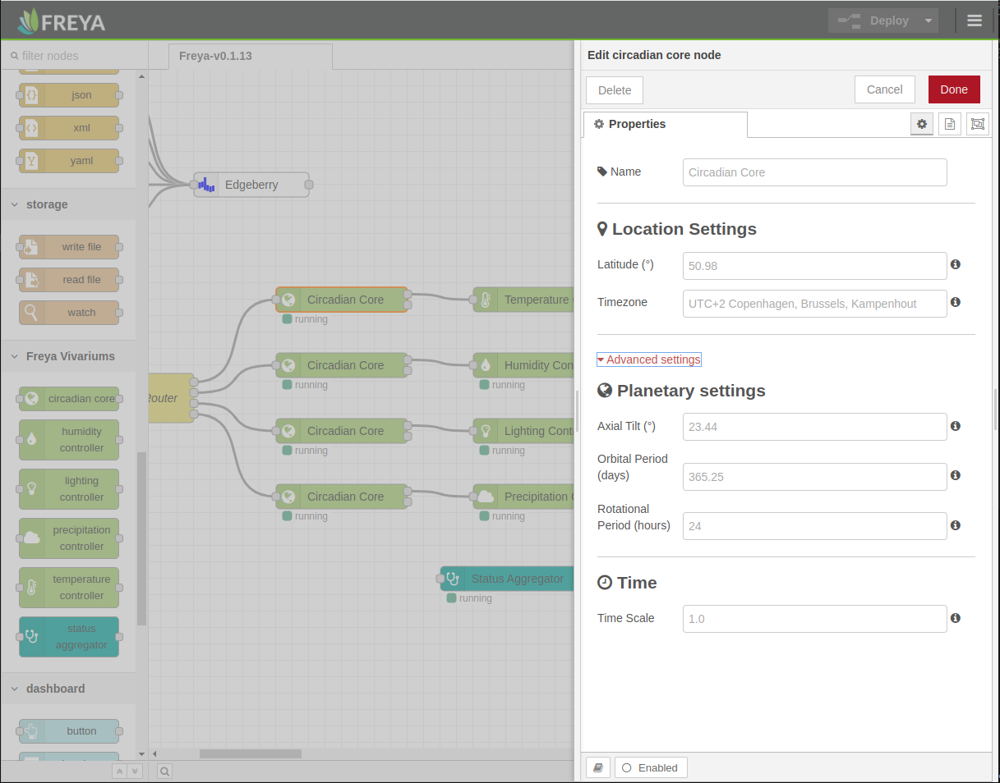

A vivarium brings the tranquility and rythms of the natural world into your living space. It fosters a deep human connection to nature by introducing an authentic living presence into our modern life.

The **Freya Vivarium Control System** helps manage and maintain the environment within your vivarium, using advanced climate control to support natural cycles. By processing data from sensors within the vivarium, such as temperature, humidity and light levels, Freya calculates the necessary actions for the actuators - such as heaters, humidifiers and lighting - to maintain the desired conditions.

#### Features
- **Climate control** for several environment variables, mimicing the natural environment.
- **Configurable cycles** for simulating day/night and seasonal changes.
- **Set it and forget it** by design. Operating quietly in the background, maintaining optimal conditions
 

### Alternate use cases
- **Greenhouse automation** and precision agriculture for optimized plant health. (e.g. growing potatoes on Mars)
- **Distributed research** on the effects of climate(change) and the adaptability of living organisms.
- **Nature preservation** by providing controlled habitats for species from endangered environments.

## Freya Vivarium Control System

### The brain of your vivarium
The Freya Vivarium Control System is a dedicated computer system engineered to monitor and regulate the environmental conditions inside vivariums. Built on robust hardware with modular expansion capabilities, it provides a reliable foundation for automating natural habitats — so you can focus on your animals and ecosystems.

 

### The mind of your vivarium
Freya is powered by Node-RED, an open-source flow-based programming tool that makes it easy to define, customize, and expand your vivarium’s logic. Whether you’re setting up temperature gradients, humidity cycles, or complex circadian lighting, Node-RED allows you to tailor the behavior to your exact needs without deep programming experience.

 

### Software Application
Freya’s intuitive dashboard gives you real-time insight into your vivarium’s conditions. Monitor temperature, humidity, lighting, and more — all with clear visualizations and historical trends. Fine-tune settings, view schedules, and ensure your vivarium stays within safe thresholds, directly from your browser.

 

## Getting Started
### Freya Hardware

### Freya Software

### Freya Community

Connect with the [Freya community on Reddit](https://www.reddit.com/r/FreyaVivariums/).

## Support us

The **Freya Vivarium Control System is open source and free to use**. The organization behind Freya will never lock features behind a paywall. All hardware designs, software, and flows are open for anyone to use, modify, and share.
If you’d like to support its development and maintenance, you can contribute code — or **become a Sponsor** to help sustain and grow the project.