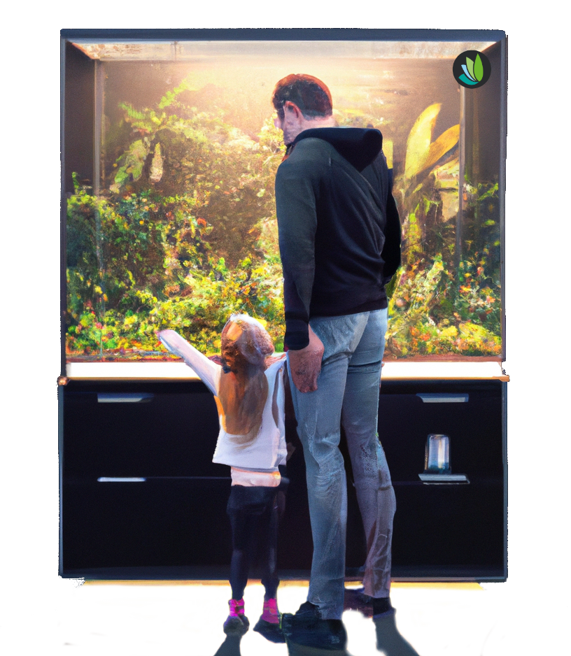
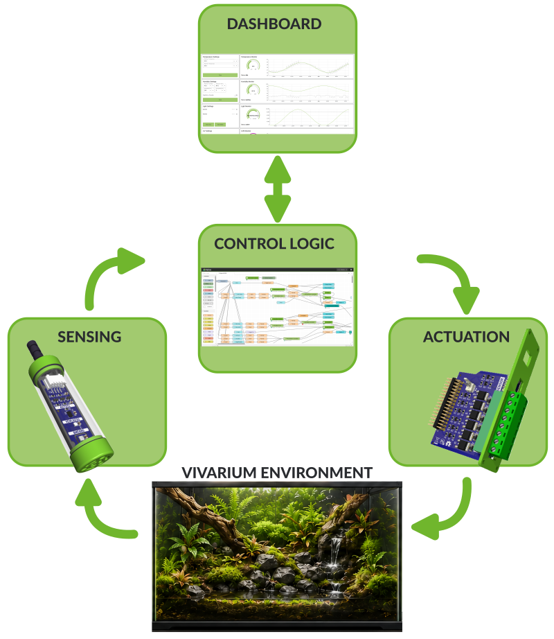

Whether you keep a living ecosystem in your home or manage vivariums professionally, the **Freya Vivarium Control System** takes care of orchestrating the climate variables allowing you to focus fully on the life inside. It monitors environmental conditions and translates sensor readings into actuator control commands through user-defined logic - as simple or complex as your methodology requires.

#### Key Features
- **Methodology-agnostic vivarium control** - Define your own environment simulation logic. Freya provides the measurements, the actuator outputs, and the framework; you provide the knowledge and methodology.
- **Co-creation platform** - Every layer of the system is modular and designed to facilitate independent evolution through collaborative creation. Freya is built to grow through its community.
- **Open in its foundations** - hardware, software, mechanical designs, and documentation are published under open source licenses and built with open source tools, on top of open source platforms.

Connect with the [Freya community on Reddit](https://www.reddit.com/r/FreyaVivariums/).

 

## How It Works

The [Freya Terra Sensor](https://github.com/Freya-Vivariums/Freya-Terra-Sensor) is positioned in vivarium, and measures the conditions (temperature, humidity, ...).
In the Freya Controller, the [Freya Sense'n'Drive Hardware Cartridge](https://github.com/Freya-Vivariums/Freya-SenseAndDrive-Hardware-Cartridge) allows the sensor to connect the controller and provides outputs for controlling actuators like misting pumps, lighting, ... .
The [Freya Node-RED Flow]() is the control logic programmed in a visual manner. Create rules and schedules that translate sensor readings into output commands - as simple or complex as your methodology requires.

 

## Support us

The **Freya Vivarium Control System is open source and free to use**. The organization behind Freya will never lock features behind a paywall. All hardware designs, software, and flows are open for anyone to use, modify, and share.
If you’d like to support its development and maintenance, you can contribute code — or make a donation through [GitHub Sponsors](https://github.com/sponsors/Freya-Vivariums)!

